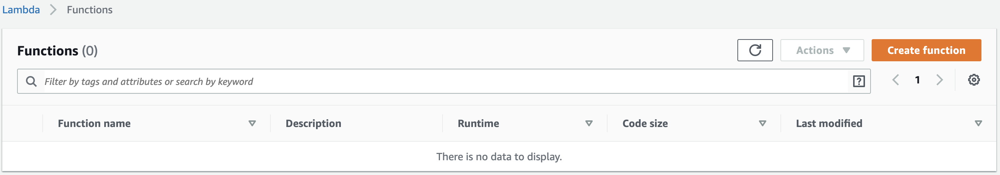
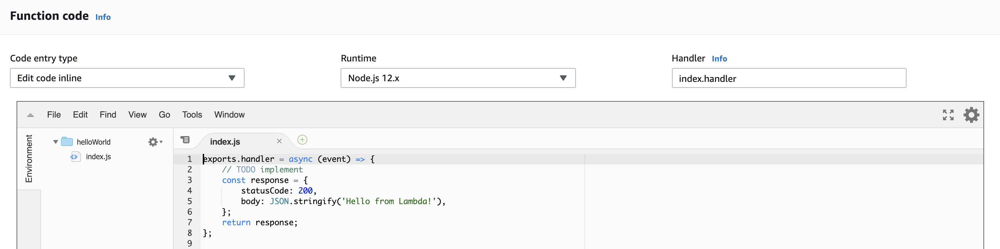
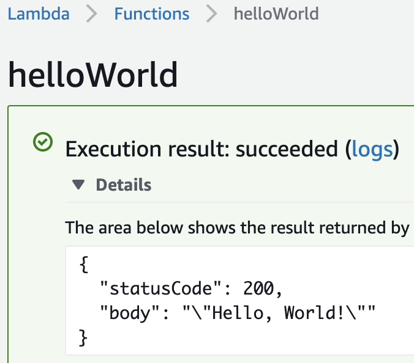

# The Lambda

Head to [the Lambda homepage](https://eu-west-1.console.aws.amazon.com/lambda/home?region=eu-west-1#/functions). You should see something that looks like this:



:mega: **NOTE**: Make sure you're set to the region `eu-west-1` in the drop-down at the top-right of the screen! AWS supports many different geographical regions (think of each of them as being a data centre). For consistency we're gonna use `eu-west-1` (Dublin).

## Create The Thing

1. Go ahead and click `Create Function`
2. Name it `helloWorld`
3. Target `Node 12.x`
4. You don't need any specific permissions
5. Hit the big fat create button

The next screen is gonna look something like this:



It's actually given us everything we need to hook up to our API which is mega. Change the body to Hello World though, eh?

```javascript
exports.handler = async event => {
  return {
    statusCode: 200,
    body: JSON.stringify("Hello, World!")
  };
};
```

This is the simplest possible example of a Lambda function. You can see that the function returns a response with a status code and a body, and takes a single parameter `event` which will contain properties relating to the Lambda execution such as the originating HTTP request etc.

This cut-down IDE has told us a few interesting things:

1. We have an `index.js` file which has a function called `handler`
2. This function has been configured as the `handler` of our Lambda function

## Let's test it!

Lambdas are executed by creating and executing `Events`. An event might be a scheduled task triggering, an email being sent or a bunch of other stuff. In our case, it's an HTTP request hitting our API Gateway!

Let's create a test event to see if our basic Lambda is working.

1. Hit `Test` over in the top-right of the page
2. Name your event `helloWorld` and hit `Create`
3. Hit the `Test` button again (note the dropdown next to the button now contains your test event)

<center>

</center>

Awesome. Now we have a function to return a response; let's define an `API Gateway` and have it route HTTP traffic to our Lambda!

[Continue your journey...](02-api-gateway.md)
