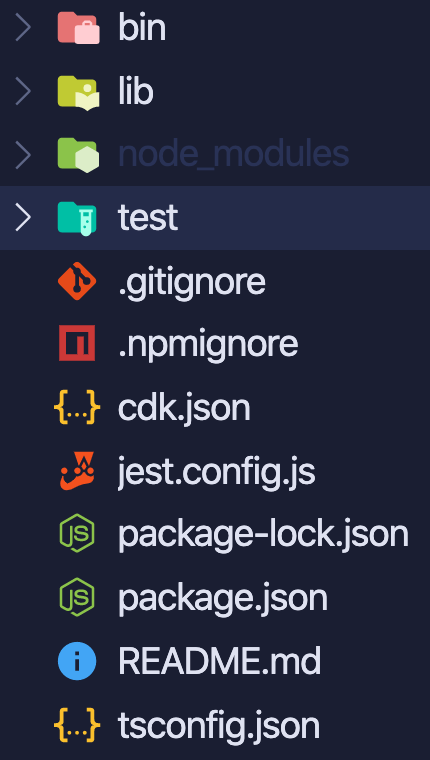

# Getting Started

For the purposes of this exercise we're going to be using the Typescript flavour of CDK, so if you haven't already, make sure you've got `NodeJS` installed and available to run the AWS CDK, then follow this guide to get the AWS CLI installed: [AWS CDK Install Guide](https://docs.aws.amazon.com/cdk/latest/guide/getting_started.html).

Depending on your setup and flavour of package manager, you're either going to use `npm` or `Yarn` to set this up. For this exercise we're going to choose to manage the dependency locally using `npm`.

## Some Terminology

We're gonna be talking about some very specific terms in these exercises which relate explicitly to `AWS CDK`. Let's take a few moment to understand what these are!

### Constructs

`Constructs` are the basic building blocks of AWS CDK apps. A construct represents a "cloud component" and encapsulates everything AWS CloudFormation needs to create the component.

### Environments

Each `Stack` instance in your AWS CDK app is explicitly or implicitly associated with an environment `env`. An environment is the target AWS account and AWS Region into which the stack is intended to be deployed.

### Resources

A `Construct` is defined of a logical grouping of related and connected AWS Resources. This can be anything from an S3 bucket or (like in this workshop, an `ApiGateway` or `Lambda`)

### Stacks

The unit of deployment in the AWS CDK is called a `Stack`. All AWS resources defined within the scope of a stack, either directly or indirectly, are provisioned as a single unit. You can define any number of stacks in your AWS CDK app. Any instance of the Stack construct represents a `Stack`, and can be either defined directly within the scope of the app.

### Apps

As described in `Constructs`, to provision infrastructure resources, all constructs that represent AWS resources must be defined, directly or indirectly, within the scope of a `Stack` construct. `Apps` are a grouping convention for _multiple_ constructs that may define an application

## AWS Authentication

This exercise builds on the [previous one](../02-aws-cli) so if you're not sure about authentication in AWS, go there first and then come back :) Once you're happy that you're correctly set up, we can continue with the exercise!

## Initialisation

Let's initialise our CDK "Stack"! Once you've installed `NodeJS` and are set up, open up your favourite terminal and run the following commands from an empty folder (accepting the defaults):

```bash
$ npx cdk --language typescript
```

This is going to initialise a CDK setup in your current working directory, and produces a _lot_ of files:



:mega: **NOTE**: The **NodeJS** ecosystem supports lots of different frameworks and "Ways of Doing Things". An exhaustive run-through of how each of these **Dotfiles** is beyond the scope of this session, save for the ones that specifically relate to the AWS CDK. Sorry!

## Code rundown

Over in the `lib` folder of your newly-generated CDK workspace, you'll see a single file named `*-stack.ts`. It's a Typescript file which is named after whichever folder you ran `cdk init` from, and it contains a barebones AWS CDK `stack`:

```typescript
import * as cdk from "@aws-cdk/core";

// This class is named after the parent folder.
export class HelloWorldStack extends cdk.Stack {
  constructor(scope: cdk.Construct, id: string, props?: cdk.StackProps) {
    super(scope, id, props);
  }
}
```

Whilst this `stack` doesn't actually _do_ anything, you can use the cdk to essentially produce a _dry run_ of what the stack should create:

```bash
$ npx cdk synth
Resources:
  CDKMetadata:
    Type: AWS::CDK::Metadata
    Properties:
      Modules: aws-cdk=1.22.0,@aws-cdk/core=1.22.0,@aws-cdk/cx-api=1.22.0,jsii-runtime=node.js/v12.8.0
    Condition: CDKMetadataAvailable
Conditions:
  CDKMetadataAvailable:
    Fn::Or:
      - Fn::Or:
          - Fn::Equals:
              - Ref: AWS::Region
              - ap-east-1
# ... Truncated for brevity
```

:mega: **NOTE**: The above text is `CloudFormation`. This is an AWS service that we've not come across just yet, but underpins a _lot_ of how AWS services are created and orchestrated. Think of it as a recipe for defining infrastructure, although instead of mixing the wet ingredients together and whisking them into the dry; here we define a bunch of AWS services and how they're wired together.

If your output looks similar to the above: [go here to continue your journey!](./02-the-stack.md) If not, shout at whomever is running your session and get them to fix it :balloon:
