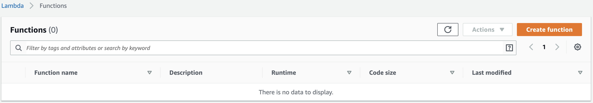
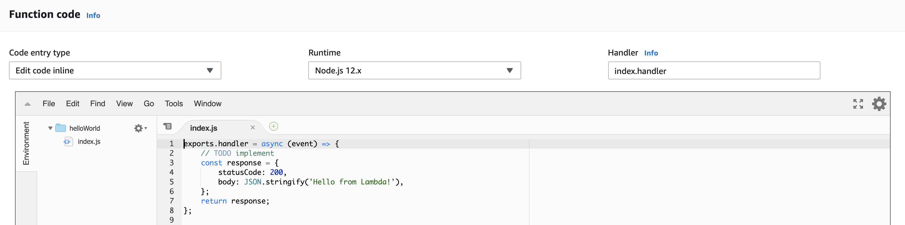
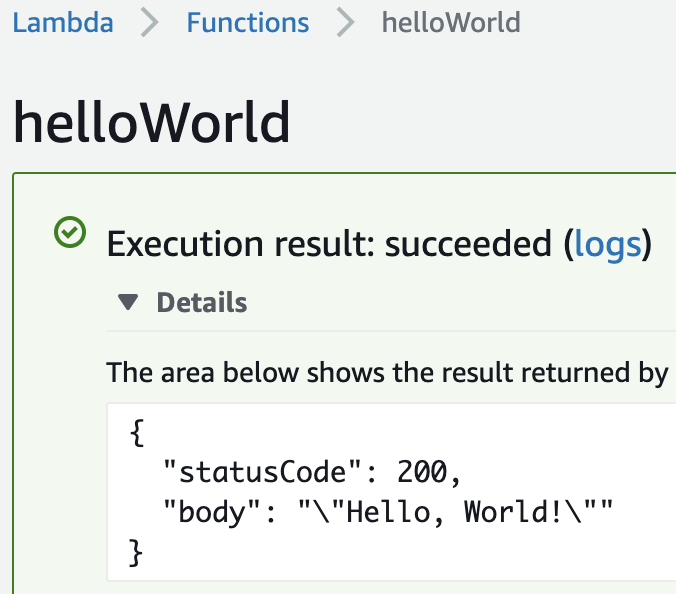
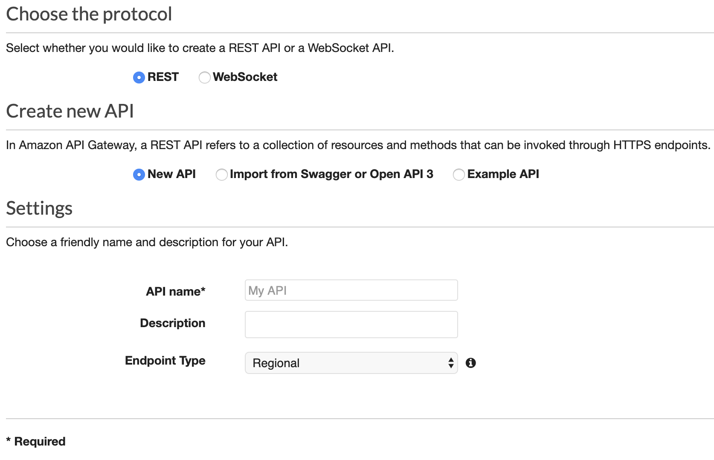
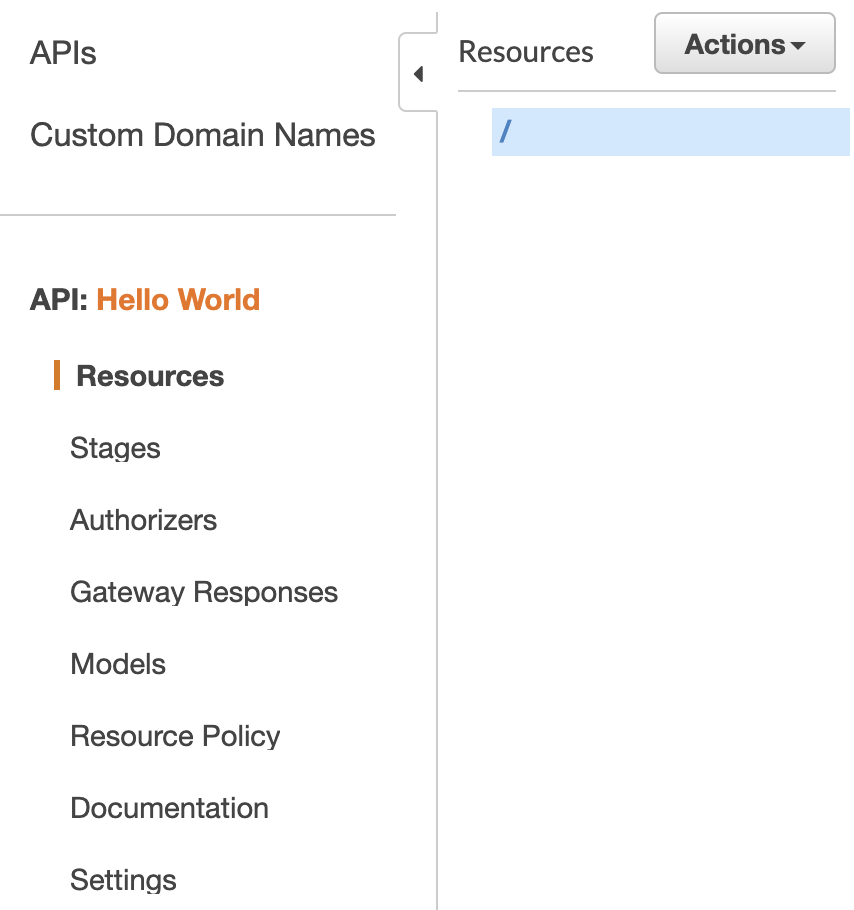
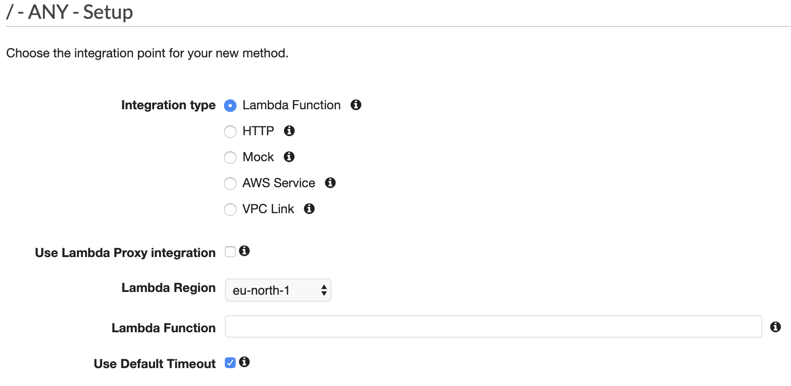
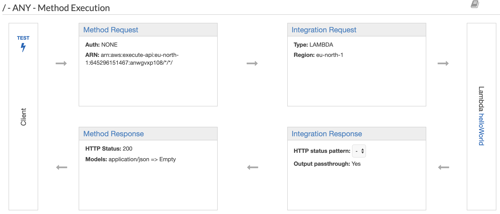
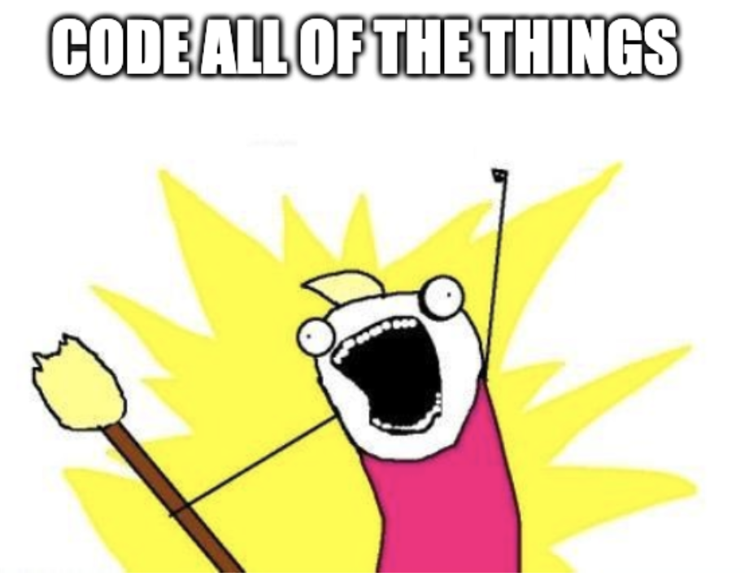

# AWS 101: Serverless APIs

---

## INTRODUCTION!


---

## DISAMBIGUATION!

### /dɪsamˈbɪɡjʊeɪt/ʃ(ə)n/

@css[text-white fragment](AWS)
@css[text-white fragment](Serverless)
@css[text-white fragment](Lambda)
@css[text-white fragment](Api Gateway)
@css[text-white fragment](IAM)

---

### AWS

> ... provides on-demand cloud computing platforms and APIs to individuals, companies, and governments, on a metered pay-as-you-go basis.

---

### Serverless

> ... a cloud-computing execution model in which the cloud provider runs the server, and dynamically manages the allocation of machine resource.

---

### Lambda

> ... lets you run code without provisioning or managing servers. You pay only for the compute time you consume.

---

### Api Gateway

> ... is a fully managed service that makes it easy for developers to create, publish, maintain, monitor, and secure APIs at any scale.

---

### IAM

> ... AWS Identity and Access Management (IAM) enables you to manage access to AWS services and resources securely.

---

## RECIPES!


---

## Recipe 01 - The AWS Console

- Point 'n' Click Infra
- Easy to create (and destroy!)
- Understand before you code

---

#### Creating the Lambda



---

#### Creating the Lambda



---

#### Creating the Lambda



---

#### Creating the Api Gateway



---

#### Creating the Api Gateway



---

#### Creating the Api Gateway



---

#### Creating the Api Gateway



---

#### Test Output

```json
{
  "statusCode": 200,
  "body": "\"Hello, World!\""
}
```

```bash
$ curl https://XXXXXXXXXX.execute-api.eu-west-1.amazonaws.com/prod/
"Hello, World!"
```

---

## Recipe 02 - The AWS CLI

- Reproducible
- Automated
- Version-controlled

---



---

### Create the Lambda

@snap[text-left]

1. Create a Lambda Execution Role

```bash
aws iam create-role \
    --role-name hello-world-lambda \
    --assume-role-policy-document file://assets/code/lambda-execution-trust-policy.json
```

2. Create Function

```bash
aws lambda create-function \
    --function-name helloWorld \
    --runtime nodejs12.x \
    --zip-file fileb://assets/code/hello-world.zip \
    --handler hello-world.handler \
    --role arn:aws:iam::XXXXXXXXXXXX:role/hello-world
```

@snapend

---

### Create the Api Gateway

@snap[text-left]

1. Create the Rest API

```bash
aws apigateway create-rest-api \
    --name 'Hello World' \
    --endpoint-configuration types=REGIONAL
```

2. Get the Root Resource

```bash
aws apigateway get-resources \
    --rest-api-id XXXXXXXXXX
```

3. Create an HTTP Method

```bash
aws apigateway put-method \
    --rest-api-id XXXXXXXXXX \
    --http-method ANY \
    --resource-id XXXXXXXXXX \
    --authorization-type NONE
```

@snapend

---

### ...Continued

@snap[text-left]

4. Define an Api Gateway Execution Role

```bash
aws iam create-role \
    --role-name hello-world-api-gateway \
    --assume-role-policy-document file://assets/code/api-gateway-execution-trust-policy.json
```

5. Define a Lambda Execution Policy

```bash
aws iam create-policy \
    --policy-name invoke-lambda \
    --policy-document file://assets/code/invoke-lambda-policy.json
```

@snapend

---

### ...Continued

@snap[text-left]

6. Attach the Policy to the Api Gateway Role

```bash
aws iam attach-role-policy \
    --role-name hello-world-api-gateway \
    --policy-arn arn:aws:iam::XXXXXXXXXXXX:policy/invoke-lambda
```

7. Attach the Lambda to the Api Gateway

```bash
aws apigateway put-integration
    --rest-api-id XXXXXXXXXX
    --resource-id XXXXXXXXXX
    --http-method ANY
    --integration-http-method POST
    --type AWS_PROXY
    --credentials arn:aws:iam::XXXXXXXXXXXX:role/hello-world-api-gateway
    --uri arn:aws:apigateway:eu-west-1:lambda:path/2015-03-31/functions/arn:aws:lambda:eu-west-1:XXXXXXXXXXXX:function:helloWorld/invocations
```

@snapend

---

## Recipe 03 - The AWS CDK

- Programmatic
- Portable
- Unit Testable

---

## Moar Terminology


---

### CloudFormation

Another sneaky AWS component. Think of CloudFormation as a YAML-y `blueprint` for creating infrastructure. Once a blueprint is created, you can tell AWS to create or "Apply" it.

---

### Stacks

The unit of deployment in the AWS CDK is called a `Stack`. All AWS resources defined within the scope of a stack are provisioned as a single unit.

---

### Constructs

`Constructs` are the basic building blocks of AWS CDK apps. A construct represents a "cloud component" and encapsulates everything AWS CloudFormation needs to create the component.

---

### Environments

Each `Stack` instance in your AWS CDK app is associated with an environment. An environment is the target AWS account and AWS Region into which the stack is intended to be deployed.

---

### Resources

A `Construct` is defined of a logical grouping of related and connected AWS Resources. This can be anything from an S3 bucket or (like in this workshop, an `ApiGateway` or `Lambda`)

---

### Apps

`Apps` are a grouping convention for _multiple_ constructs that may define an application

---

## Codetime


---

### The Stack

@snap[text-left]

#### Code

```typescript
export class AssetsStack extends Stack {
  constructor(scope: Construct, id: string, props?: StackProps) {
    super(scope, id, props);
  }
}
```

@snapend

---

### The Lambda

@snap[text-left]

#### Code

```typescript
const handler = new Function(this, "HelloWorldLambda", {
  functionName: "helloWorld",
  code: Code.fromAsset("../../assets/code/hello-world.zip"),
  handler: "hello-world.handler",
  runtime: Runtime.NODEJS_12_X
});
```

@snapend

---

### The Rest API

@snap[text-left]

#### Code

```typescript
const api = new RestApi(this, "HelloWorldApiGateway", {
  restApiName: "Hello World",
  endpointTypes: [EndpointType.REGIONAL]
});

const method = api.root.addMethod("ANY", new LambdaIntegration(handler));

const deployment = new Deployment(this, "TestDeployment", {
  api
});

new Stage(this, "TestStage", {
  stageName: "Test",
  deployment
});

deployment.node.addDependency(method);
```

@snapend

---

## Recipe 04 - Terraform

- Declarative
- Agnostic(ish)
- Stateful

---

@snap[west span-40 text-center]

#### Imperative

Defines a series of steps to arrive at end state.

@snapend

@snap[east span-40 text-center]

#### Declarative

Defines end state. Computer works out how to get there.

@snapend

---

## What is Terraform?

> ... enables users to define and provision data center infrastructure using a high-level configuration language.

---

## Codetime


---

### The Lambda

@snap[text-left]

#### Code

```terraform
resource "aws_lambda_function" "hello_world" {
  filename      = "../assets/code/hello-world.zip"
  function_name = "helloWorld"
  role          = aws_iam_role.lambda_execution_role.arn
  handler       = "hello-world.handler"
  runtime       = "nodejs12.x"
}
```

@snapend

---

### The Rest API

@snap[text-left]

#### Code

```terraform
resource "aws_api_gateway_rest_api" "hello_world" {
  name = "Hello World"

  endpoint_configuration {
    types = ["REGIONAL"]
  }
}

resource "aws_api_gateway_method" "any" {
  rest_api_id   = aws_api_gateway_rest_api.hello_world.id
  resource_id   = aws_api_gateway_rest_api.hello_world.root_resource_id
  http_method   = "ANY"
  authorization = "NONE"
}
```

@snapend

---

### The Lambda Integration

@snap[text-left]

#### Code

```terraform
resource "aws_api_gateway_integration" "lambda" {
  rest_api_id             = aws_api_gateway_rest_api.hello_world.id
  resource_id             = aws_api_gateway_rest_api.hello_world.root_resource_id
  http_method             = aws_api_gateway_method.any.http_method
  integration_http_method = "POST"
  type                    = "AWS_PROXY"
  uri                     = "arn:aws:apigateway:${var.region}:lambda:path/2015-03-31/functions/${aws_lambda_function.hello_world.arn}/invocations"
  credentials             = aws_iam_role.apigateway_execution_role.arn
}
```

@snapend

---

## Questions?

---

## Thanks!
