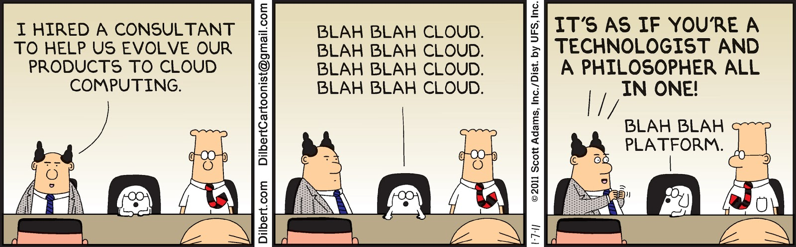
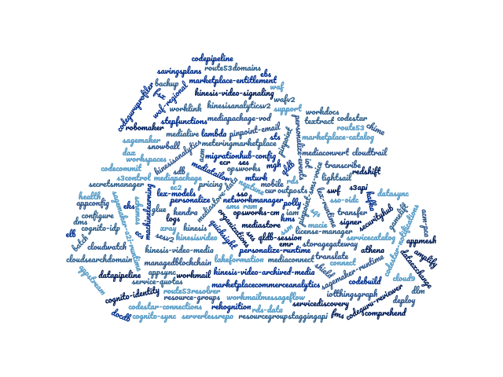

# AWS 101: Serverless APIs

---

## INTRODUCTION!



---

## DISAMBIGUATION!

### /dɪsamˈbɪɡjʊeɪt/ʃ(ə)n/

@css[text-white fragment](AWS)
@css[text-white fragment](Serverless)
@css[text-white fragment](IAM)
@css[text-white fragment](Lambda)
@css[text-white fragment](API Gateway)

---

## RECIPES!


---

## Recipe 01 - The AWS Console

- Point 'n' Click Infra
- Easy to create (and destroy!)
- Understand before you code

---

### The Lambda

> ... lets you run code without provisioning or managing servers. You pay only for the compute time you consume.

---


---


---


---

### The Api Gateway

> ... is a fully managed service that makes it easy for developers to create, publish, maintain, monitor, and secure APIs at any scale.

---


---


---


---


---

### Test Output

```json
{
  "statusCode": 200,
  "body": "\"Hello, World!\""
}
```

```bash
$ curl https://XXXXXXXXXX.execute-api.eu-west-1.amazonaws.com/prod/
"Hello, World!"
```

---

## Recipe 02 - The AWS CLI

- Reproducible
- Automated
- Version-controlled

---


---

### Create the Lambda

@snap[text-left]

1. Create a Lambda Execution Role

```bash
aws iam create-role \
    --role-name hello-world-lambda \
    --assume-role-policy-document file://assets/code/lambda-execution-trust-policy.json
```

2. Create Function

```bash
aws lambda create-function \
    --function-name helloWorld \
    --runtime nodejs12.x \
    --zip-file fileb://assets/code/hello-world.zip \
    --handler hello-world.handler \
    --role arn:aws:iam::XXXXXXXXXXXX:role/hello-world
```

@snapend

---

### Create the Api Gateway

@snap[text-left]

1. Create the Rest API

```bash
aws apigateway create-rest-api \
    --name 'Hello World' \
    --endpoint-configuration types=REGIONAL
```

2. Get the Root Resource

```bash
aws apigateway get-resources \
    --rest-api-id XXXXXXXXXX
```

3. Create an HTTP Method

```bash
aws apigateway put-method \
    --rest-api-id XXXXXXXXXX \
    --http-method ANY \
    --resource-id XXXXXXXXXX \
    --authorization-type NONE
```

@snapend

---

@snap[text-left]

4. Define an Api Gateway Execution Role

```bash
aws iam create-role \
    --role-name hello-world-api-gateway \
    --assume-role-policy-document file://assets/code/api-gateway-execution-trust-policy.json
```

5. Define a Lambda Execution Policy

```bash
aws iam create-policy \
    --policy-name invoke-lambda \
    --policy-document file://assets/code/invoke-lambda-policy.json
```

@snapend

---

@snap[text-left]

6. Attach the Policy to the Api Gateway Role

```bash
aws iam attach-role-policy \
    --role-name hello-world-api-gateway \
    --policy-arn arn:aws:iam::XXXXXXXXXXXX:policy/invoke-lambda
```

7. Attach the Lambda to the Api Gateway

```bash
aws apigateway put-integration
    --rest-api-id XXXXXXXXXX
    --resource-id XXXXXXXXXX
    --http-method ANY
    --integration-http-method POST
    --type AWS_PROXY
    --credentials arn:aws:iam::XXXXXXXXXXXX:role/hello-world-api-gateway
    --uri arn:aws:apigateway:eu-west-1:lambda:path/2015-03-31/functions/arn:aws:lambda:eu-west-1:XXXXXXXXXXXX:function:helloWorld/invocations
```

@snapend

---

## Recipe 03 - The AWS CDK

- Programmatic
- Portable
- Unit Testable

---

## Some Terminology

We're gonna be talking about some very specific terms in these exercises which relate explicitly to `AWS CDK`. Let's take a few moment to understand what these are!



### Constructs

`Constructs` are the basic building blocks of AWS CDK apps. A construct represents a "cloud component" and encapsulates everything AWS CloudFormation needs to create the component.

### Environments

Each `Stack` instance in your AWS CDK app is explicitly or implicitly associated with an environment `env`. An environment is the target AWS account and AWS Region into which the stack is intended to be deployed.

### Resources

A `Construct` is defined of a logical grouping of related and connected AWS Resources. This can be anything from an S3 bucket or (like in this workshop, an `ApiGateway` or `Lambda`)

### Stacks

The unit of deployment in the AWS CDK is called a `Stack`. All AWS resources defined within the scope of a stack, either directly or indirectly, are provisioned as a single unit. You can define any number of stacks in your AWS CDK app. Any instance of the Stack construct represents a `Stack`, and can be either defined directly within the scope of the app.

### Apps

As described in `Constructs`, to provision infrastructure resources, all constructs that represent AWS resources must be defined, directly or indirectly, within the scope of a `Stack` construct. `Apps` are a grouping convention for _multiple_ constructs that may define an application

---

## Recipe 04 - Terraform

- Declarative
- Agnostic
- Stateful

---

## Thank you for coming to my TED Talk
